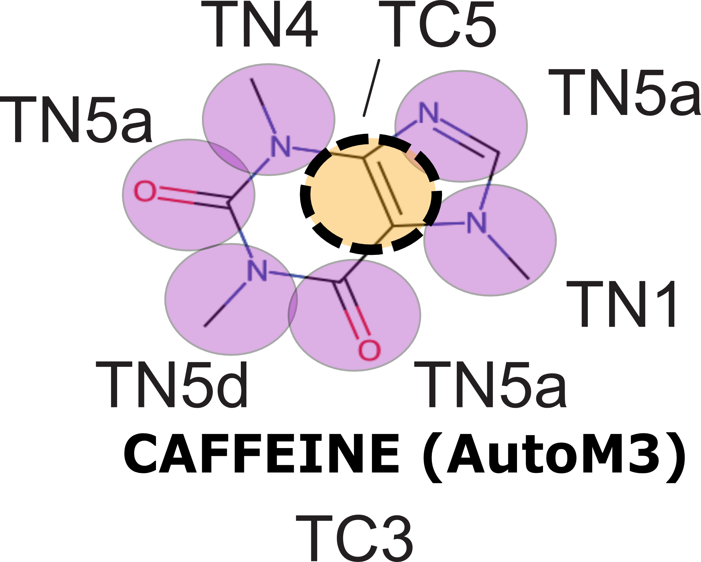

Prerequisites: You need to have GROMACS installed on your machine!

#### Installing Auto-MartiniM3 (without creating conda environment)

    git clone https://github.com/Martini-Force-Field-Initiative/Automartini_M3.git
    cd Automartini_M3
    pip install .
    cd ../LaunchMolWatBox/   
    
To use AutomartiniM3
    python -m auto_martiniM3 [mode] [options]
    
## Creating Coarse-Grained model with Auto-MartiniM3
 
On the example of caffeine molecule
 - From a SMILES code:  
   
       python -m auto_martiniM3 --smi "CN1C=NC2=C1C(=O)N(C(=O)N2C)C" --mol CAFF --aa CAFF_aa.gro

 - From a SDF file:  
   
       python -m auto_martiniM3 --sdf caffeine.sdf --mol CAF_SD

    
    

  <em>Figure 1 | Structure of the caffeine molecule</em>

  

 - __Check the generated files using texteditor and VMD. What are the differences ?__
   
   
### Testing the model in a water box
 
Run the commands with GROMACS in bash:
 

*   insert one molecule parametrized with Auto Martini M3 into the water box
        
        gmx solvate -cp CAFF.gro -cs Water_CG.gro -o CAFF_CG_BW.gro -box 5 5 5
    
## Creating the topology file

*  Now, you need to create a topology file (.top). Use the file system_init.top provided.
   Pay attention to the Martini path—it must point to the corresponding file.
   If it does not, adjust the Martini path accordingly
    
        cp system_init.top system.top
   
*  To generate a correct topology file, include the ITP file previously created with Auto Martini M3.
You must also determine the number of water molecules present in your system. The following command lines can be used:

        water_mols=$(grep W  CAFF_CG_BW | wc -l)
        echo "CAFF               1" >> system.top
        echo "W               $water_mols" >> system.top
        sed -i'' -e  s"/xxx/CAFF/"g system.top
   
## How to prepare and run minimization , equilibration and short production  

#### Minimization

    
       
    gmx grompp -p system.top -c CAFF_CG_BW.gro -f martini_em.mdp  -o 1-min_CAFF_CG.tpr -po 1-min.mdp  -maxwarn 3
    gmx mdrun -v -deffnm 1-min_${solute_name} -nt 8 >> mdrun.log 2>&1

#### Equilibration
    
    gmx grompp -p system.top -c 1-min_${solute_name}.gro   -f martini_eq.mdp  -o 2-eq_${solute_name}.tpr  -po 2-eq.mdp  -maxwarn 3
    gmx mdrun -v -deffnm 2-eq_${solute_name}  -nt 8  >> mdrun.log 2>&1

#### Production  
        
        gmx grompp -p system.top -c 2-eq_${solute_name}.gro    -f martini_run.mdp -o 3-run_${solute_name}.tpr -po 3-run.mdp  -maxwarn 3
        gmx mdrun -v -deffnm 3-run_${solute_name}  -nt 12

 __If the simulation in a water box will finish without any problems, we can go on and work with more complicated system.__

*   center the system around protein
     
    
        echo -e "2\n0\n" | gmx trjconv -f 3-run_${solute_name}.xtc -s 3-run_${solute_name}.tpr -o 3-run_${solute_name}_centered.xtc -center -pbc mol
    
   
     

### What if my simulation crashes?
 
Well, in that case we will have to play a little bit with molecule's topology by hand, or by using open source programs from Martini Universe, like bartender. During this workshop, we're going to try optimizing molecules by hand. Small molecules can be quite problematic to parametrize, especially if their structure includes aromatic cycles. First thing we can try is smoothing the equilibration process by dividing it into 3 or 4 steps. We start with very low timestep value, like 2 fs, and with each step we increase this parameter to arrive to 10 fs. Then, we can run production in 10 fs, which is enough for small molecules.
 
If instabilities still occur, we will have to go into nitty gritty model optimization. For bigger molecules, Auto-MartiniM3 creates multiple bonded parameters, like improper dihedrals, to hold molecule together, which can introduce instabilities with GROMACS. To improve our model, first thing we can try is removing all the dihedrals and try simulating. If a molecule is stable, you can start including dihedral angles one by one to identify which one was causing the problem and leave it behind. It's always better to have some dihedral angles defined. Another error in the topology could be the force values chosen by default in Auto-MartiniM3. You can try to optimize them by using the tools avaliable online, like bartender. For this, you will need a special input file, which can be generated automatically by Auto-MartiniM3 with -bartender flag.
 

## Simulation with Adenosine 2 receptor embedded in POPC membrane
 
First, let's create a system with the protein embedded in the POPC membrane, with ligand (here it would be caffeine) in the solvent. We simulate without a priori, so that we could see if any interactions occur by themselves.
 

*   add 10 molecules of ligand to already prepared protein-membrane-solvent system
     
    
        gmx insert-molecules -f 3rfm_popc.gro -ci ${mol}.gro -nmol 10 -try 500 -o 3rfm_popc_${mol}.gro -replace W
    
    *   make necessary changes to the topology file, by recounting water beads and adding ligand molecules
         

    cp 3rfm_popc.top 3rfm_popc_${mol}.top
    sed -i s"/molname/${mol}/" 3rfm_popc_${mol}.top
    
    solvent_lines=$(grep W 3rfm_popc_${mol}.gro | wc -l)
    solvent_molecules=$((solvent_lines - 1))
    NA_molecules=$(grep NA 3rfm_popc_${mol}.gro | wc -l)
    CL_molecules=$(grep CL 3rfm_popc_${mol}.gro | wc -l)
    
    echo "W              ${solvent_molecules}" >> 3rfm_popc_${mol}.top
    echo "NA             ${NA_molecules}" >> 3rfm_popc_${mol}.top
    echo "CL             ${CL_molecules}" >> 3rfm_popc_${mol}.top
    echo "${mol}            10" >> 3rfm_popc_${mol}.top

*   create index file for handling NPT and NVT for distinct groups of molecules in the system
     

    {
                            echo "del 2-18"
                            echo "r W | r ION | r ${mol:0:4}"
                            echo "name 2 Solvent"
                            echo "r POPC"
                            echo "name 3 Bilayer"
                            echo "1 | r TW"
                            echo "q"
                        } > index-selection.txt
    
    gmx make_ndx -f 3rfm_popc_${mol}.gro -o 3rfm_popc_${mol}.ndx < index-selection.txt

With system ready, verify if you have all needed input files : topology files, mdp files with GROMACS parameters, etc.
 
Launch minimization, 4 steps of equilibration where at each step we increase the size of time step, and production of 2 microseconds.
 

    gmx grompp -f min-A2A-lig.mdp -c 3rfm_popc_${mol}.gro -r 3rfm_popc_${mol}.gro -p 3rfm_popc_${mol}.top -n 3rfm_popc_${mol}.ndx -o 3rfm_popc_${mol}_min.tpr -maxwarn 2
    
    gmx mdrun -deffnm 3rfm_popc_${mol}_min -ntmpi 8  -v
    
    gmx grompp -f eq0-A2A-lig.mdp -c 3rfm_popc_${mol}_min.gro -r 3rfm_popc_${mol}.gro -p 3rfm_popc_${mol}.top -n 3rfm_popc_${mol}.ndx -o 3rfm_popc_${mol}_eq0.tpr -maxwarn 3
    
    gmx mdrun -deffnm 3rfm_popc_${mol}_eq0 -ntmpi 8  -v
    
    gmx grompp -f eq1-A2A-lig.mdp -c 3rfm_popc_${mol}_eq0.gro -r 3rfm_popc_${mol}.gro -p 3rfm_popc_${mol}.top -n 3rfm_popc_${mol}.ndx -o 3rfm_popc_${mol}_eq1.tpr -maxwarn 3
    
    gmx mdrun -deffnm 3rfm_popc_${mol}_eq1 -ntmpi 8  -v
    
    gmx grompp -f eq2-A2A-lig.mdp -c 3rfm_popc_${mol}_eq1.gro -r 3rfm_popc_${mol}.gro -p 3rfm_popc_${mol}.top -n 3rfm_popc_${mol}.ndx -o 3rfm_popc_${mol}_eq2.tpr -maxwarn 3
    
    gmx mdrun -deffnm 3rfm_popc_${mol}_eq2 -ntmpi 8  -v
    
    gmx grompp -f eq3-A2A-lig.mdp -c 3rfm_popc_${mol}_eq2.gro -r 3rfm_popc_${mol}.gro -p 3rfm_popc_${mol}.top -n 3rfm_popc_${mol}.ndx -o 3rfm_popc_${mol}_eq3.tpr -maxwarn 3
    
    gmx mdrun -deffnm 3rfm_popc_${mol}_eq3 -ntmpi 8  -v
    
    gmx grompp -f md-A2A-lig.mdp -c 3rfm_popc_${mol}_eq3.gro -r 3rfm_popc_${mol}.gro -p 3rfm_popc_${mol}.top -n 3rfm_popc_${mol}.ndx -o 3rfm_popc_${mol}_md.tpr -maxwarn 3
    
    gmx mdrun -deffnm 3rfm_popc_${mol}_md -ntmpi 8  -v -cpi 3rfm_popc_${mol}_md.cpt -noappend

*   center the system around protein
     

    echo -e "1\n0\n" |gmx trjconv -s 3rfm_popc_${mol}_md.tpr -f 3rfm_popc_${mol}_md.part0001.xtc -o 3rfm_popc_${mol}_md_centered.xtc -pbc mol -center

*   create pdb file for pretty visualisation of bonds
     

    echo 0 | gmx trjconv -f 3rfm_popc_${mol}_md.part0001.gro -s 3rfm_popc_${mol}_md.tpr -conect -o 3rfm_popc_${mol}_md-conect.pdb -pbc whole
    
    sed -i '/ENDMDL/d'  3rfm_popc_${mol}_md-conect.pdb

# Analyze results
 

## in VMD
 
Visualize the system with VMD by loading the trajectory
 

    vmd  3rfm_popc_${mol}_md-conect.pdb 3rfm_popc${mol}_md_centered.xtc 

### Commands in VMD
 
focus view on protein's backbone
 

    Extensions -> Analysis -> RMSD Trajectory Tool type "type BB" and click ALIGN on Top reference mol (by default)

Display settings for better view
 

    Display -> Orthographic Display -> check Antialiasing only Display -> Axes -> Off Display -> Rendermode -> GLSL

Show components of interest - protein backbone, lipid heads and ligand molecules
 

    Graphics -> Representations ...
    Create Rep -> type BB -> Drawing Method -> VMD (Sphere Scale 0.4) -> Coloring Method -> ResType
    Create Rep -> type BB -> Drawing Method -> DynamicBonds (Distance Cutoff 4.6 ; Bond Radius 0.6) -> Coloring Method -> ResType
    Create Rep -> type PO4 -> Drawing Method -> VMD (Sphere Scale 1) -> Coloring Method -> ColorID -> 6 (Silver)
    Create Rep -> resname CAFF -> Drawing Method -> VMD (Sphere Scale 1) -> Coloring Method -> ColorID -> 13(Mauve)

Change Background
 

    Graphics -> Colors... -> Display -> Background -> 8 (white)

Enhance representation with skin settings
 

    Graphics -> Materials -> Opaque Ambient 0.5 Diffuse 0.75 Opacity 0.32 Outline 1.5 OutlineWidth 0.5

### Some quantitative analysis in VMD
 
VolMap
 

    Extensions -> Analysis -> VolMap Tool ; selection: resname CAFF ; check compute for all frames,... ; click Create Map
