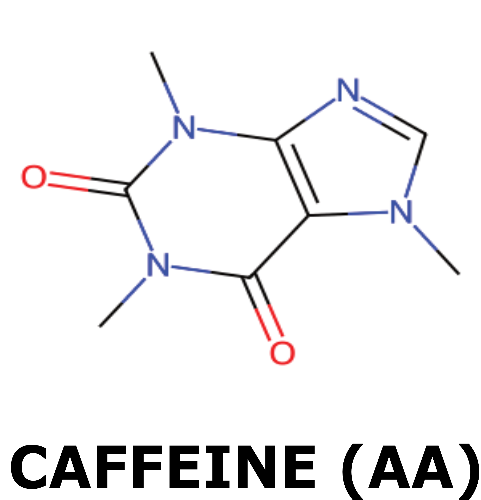
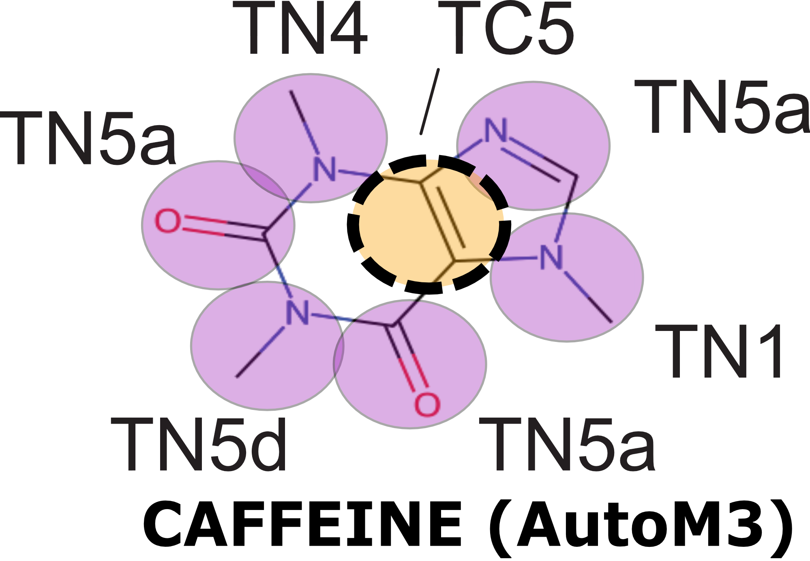

Prerequisites: You need to have GROMACS installed on your machine!


# Installing Auto-MartiniM3 (without creating conda environment)

    git clone https://github.com/M2BMI-Lab/Workshop-MartiniOdyssey.git
    cd Workshop-MartiniOdyssey
    bash setup.sh
    source Workshop_AutoM3/bin/activate
    cd ../LaunchMolWatBox/   

    
    <!-- cd Tutorial-Parametrization-datafiles/ -->
    
To use AutomartiniM3

    python -m auto_martiniM3 [mode] [options]

    
## Creating Coarse-Grained model with Auto-MartiniM3

We will need a unique SMILES string of each molecule of interest, like caffeine (1,3,7-trimethyl-1H-purine-2,6(3H,7H)-dione). To obtain the SMILE string, from your pdb or direct drawing using [OpenBabel server](https://www.cheminfo.org/Chemistry/Cheminformatics/FormatConverter/index.html).


On the example of caffeine molecule, the smile is `CN1C=NC2=C1C(=O)N(C(=O)N2C)C`  

There are two approaches to generate a coarse-grained (CG) model of a small ligand using AutoMartini3:

 - From a SMILES code:  
   
       python -m auto_martiniM3 --smi "CN1C=NC2=C1C(=O)N(C(=O)N2C)C" --mol CAFF --aa CAFF_aa.gro

 - From a SDF file:  
   
       python -m auto_martiniM3 --sdf caffeine.sdf --mol CAF_SD

<p align="center">
    
    
</p>
<p align="center">
  <em>Figure 1 | Structure of the caffeine molecule</em>
</p>  


# Simulation with Adenosine 2 receptor embedded in POPC membrane

First, let's create a system with the protein embedded in the POPC membrane, with ligand (here it would be caffeine) in the solvent.  
We simulate without a priori, so that we could see if any interactions occur by themselves.

*  Go to repository with all needed files (remember to move the topology and coordinates files of the liand with you)
```bash
cd Tutorial-Simulation-with-GPCR-datafiles/
mv ../CAFF* ./
```

*   Add 10 molecules of ligand to already prepared protein-membrane-solvent system
     
```bash
gmx_mpi insert-molecules -f 3rfm_popc.gro -ci CAFF.gro -nmol 10 -try 500 -o 3rfm_popc_CAFF.gro -replace W
```
<p align="center">
    
</p>
<p align="center">
  <em>Figure 2 | Visualisation of caffeine molecules with A2A receptor in POPC membrane</em>
</p>
    

*   Make necessary changes to the topology file, by recounting water beads and adding ligand molecules  

```bash
cp 3rfm_popc.top 3rfm_popc_CAFF.top
```
*   In the new topology just create  you have change the string ```molname``` by the name of your molecule.
    In this example, replace `molname` with `CAFF`

```bash
sed  d -i s"/LIGAND/CAFF/" 3rfm_popc_CAFF.top
```
    
*   Then, determine the number of sodium ions, chloride ions, and water molecules in the newly created structure file, either manually or by using the following small script:
```bash
solvent_lines=$(grep W 3rfm_popc_${mol}.gro | wc -l)
solvent_molecules=$((solvent_lines - 1))
NA_molecules=$(grep NA 3rfm_popc_${mol}.gro | wc -l)
CL_molecules=$(grep CL 3rfm_popc_${mol}.gro | wc -l)

echo "W              ${solvent_molecules}" >> 3rfm_popc_${mol}.top
echo "NA             ${NA_molecules}" >> 3rfm_popc_${mol}.top
echo "CL             ${CL_molecules}" >> 3rfm_popc_${mol}.top
echo "${mol}            10" >> 3rfm_popc_${mol}.top
```

*   create index file for handling NPT and NVT for distinct groups of molecules in the system
     
```bash
{
    echo "del 2-18"  
    echo "r W | r ION | r CAFF"  
    echo "name 2 Solvent"
    echo "r POPC"
    echo "name 3 Bilayer"
    echo "1 | r TW"
    echo "q"
    } > index-selection.txt
```
```bash    
    gmx_mpi make_ndx -f 3rfm_popc_CAFF.gro -o 3rfm_popc_CAFF.ndx < index-selection.txt
```

With system ready, verify if you have all needed input files : topology files, mdp files with GROMACS parameters, etc.
 
Launch minimization, 4 steps of equilibration where at each step we increase the size of time step, and production of 2 microseconds.
* __Minimization__
```bash  
gmx_mpi grompp -f min-A2A-lig.mdp -c 3rfm_popc_CAFF.gro -r 3rfm_popc_CAFF.gro -p 3rfm_popc_CAFF.top -n 3rfm_popc_CAFF.ndx -o 3rfm_popc_CAFF_min.tpr -maxwarn 2
gmx_mpi mdrun -deffnm 3rfm_popc_CAFF_min -v
```
* __4 steps of equilibration where at each step we increase the size of time step__
```bash      
## equilibration 1
gmx_mpi grompp -f eq0-A2A-lig.mdp -c 3rfm_popc_CAFF_min.gro -r 3rfm_popc_CAFF.gro -p 3rfm_popc_CAFF.top -n 3rfm_popc_CAFF.ndx -o 3rfm_popc_CAFF_eq0.tpr -maxwarn 3
gmx_mpi mdrun -deffnm 3rfm_popc_CAFF_eq0 -v
## equilibration 2
gmx_mpi grompp -f eq1-A2A-lig.mdp -c 3rfm_popc_CAFF_eq0.gro -r 3rfm_popc_CAFF.gro -p 3rfm_popc_CAFF.top -n 3rfm_popc_CAFF.ndx -o 3rfm_popc_CAFF_eq1.tpr -maxwarn 3
gmx_mpi mdrun -deffnm 3rfm_popc_CAFF_eq1 -v
## equilibration 3    
gmx_mpi grompp -f eq2-A2A-lig.mdp -c 3rfm_popc_CAFF_eq1.gro -r 3rfm_popc_CAFF.gro -p 3rfm_popc_CAFF.top -n 3rfm_popc_CAFF.ndx -o 3rfm_popc_CAFF_eq2.tpr -maxwarn 3
gmx_mpi mdrun -deffnm 3rfm_popc_CAFF_eq2 -v
## equilibration 4     
gmx_mpi grompp -f eq3-A2A-lig.mdp -c 3rfm_popc_CAFF_eq2.gro -r 3rfm_popc_CAFF.gro -p 3rfm_popc_CAFF.top -n 3rfm_popc_CAFF.ndx -o 3rfm_popc_CAFF_eq3.tpr -maxwarn 3 
gmx_mpi mdrun -deffnm 3rfm_popc_CAFF_eq3 -v
```
* __Production of 2 microseconds__
```bash  
gmx_mpi grompp -f md-A2A-lig.mdp -c 3rfm_popc_CAFF_eq3.gro -r 3rfm_popc_CAFF.gro -p 3rfm_popc_CAFF.top -n 3rfm_popc_CAFF.ndx -o 3rfm_popc_CAFF_md.tpr -maxwarn 3
gmx_mpi mdrun -deffnm 3rfm_popc_${mol}_md -v -cpi 3rfm_popc_CAFF_md.cpt -noappend
```

## Center the system around protein with GROMACS commands 
```bash
gmx_mpi trjconv -s 3rfm_popc_CAFF_md.tpr -f 3rfm_popc_CAFF_md.part0001.xtc -o 3rfm_popc_CAFF_md_centered.xtc -pbc mol -center
```

<!-- *   create pdb file for pretty visualisation of bonds
  
 
    echo 0 | gmx_mpi trjconv -f 3rfm_popc_CAFF_md.part0001.gro -s 3rfm_popc_${mol}_md.tpr -conect -o 3rfm_popc_CAFF_md-conect.pdb -pbc whole
    sed -i '/ENDMDL/d'  3rfm_popc_CAFF_md-conect.pdb
-->

# Visualisation of the simulation with VMD
 
Visualize the system with VMD by loading the trajectory
```bash
    vmd  3rfm_popc_CAFF_md-conect.pdb 3rfm_popc_CAFF_md_centered.xtc 
```

### Commands in VMD
 
focus view on protein's backbone
 

    Extensions -> Analysis -> RMSD Trajectory Tool type "type BB" and click ALIGN on Top reference mol (by default)


Display settings for better view
 

    Display -> Orthographic Display -> check Antialiasing only Display -> Axes -> Off Display -> Rendermode -> GLSL

Show components of interest - protein backbone, lipid heads and ligand molecules
 

    Graphics -> Representations ...
    Create Rep -> type BB -> Drawing Method -> VMD (Sphere Scale 0.4) -> Coloring Method -> ResType
    Create Rep -> type BB -> Drawing Method -> DynamicBonds (Distance Cutoff 4.6 ; Bond Radius 0.6) -> Coloring Method -> ResType
    Create Rep -> type PO4 -> Drawing Method -> VMD (Sphere Scale 1) -> Coloring Method -> ColorID -> 6 (Silver)
    Create Rep -> resname CAFF -> Drawing Method -> VMD (Sphere Scale 1) -> Coloring Method -> ColorID -> 13(Mauve)

Change Background
 

    Graphics -> Colors... -> Display -> Background -> 8 (white)

Enhance representation with skin settings
 

    Graphics -> Materials -> Opaque Ambient 0.5 Diffuse 0.75 Opacity 0.32 Outline 1.5 OutlineWidth 0.5

### Some quantitative analysis in VMD
 
VolMap - creates volumetric maps based on the molecular data.  We will use the density mode, which creates a map of the weighted atomic density at each gridpoint, calculated with a normalized gaussian distribution. For more information, see [VMD documentation](https://www.ks.uiuc.edu/Research/vmd/vmd-1.9.1/ug/node153.html).
 

    Extensions -> Analysis -> VolMap Tool ; selection: resname CAFF ; volmap type: density ; resolution: 1.0 A ; atom size: 1.0 x radius ; weights: mass ; check compute for all frames, and combine using avg ; click Create Map
